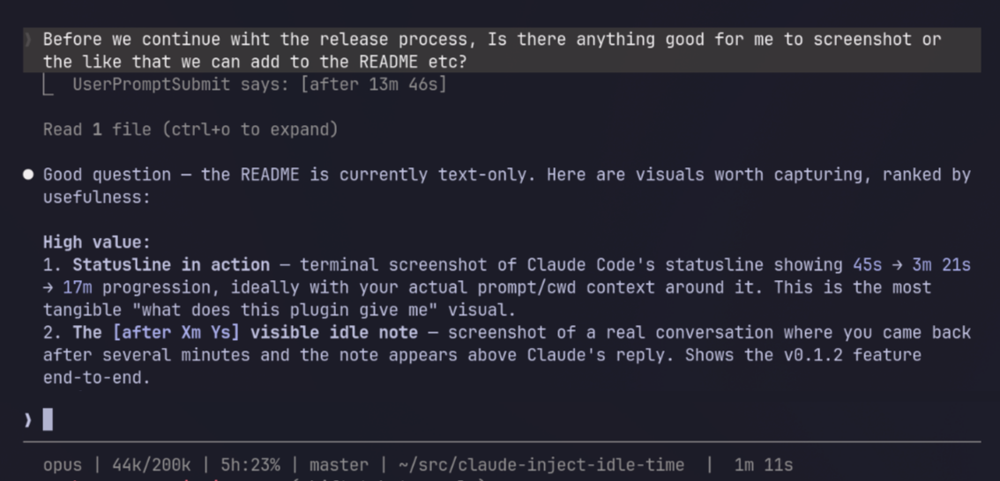

# Claude Code Idle Timing Plugin

Give Claude Code — and yourself — a sense of wall-clock time: a visible `[HH:MM:SS]` on every message, a hidden timing block Claude can reason about, idle-gap notes, an MCP time server, and a retrospective `/timestamps` timeline. Every surface is independently toggleable.

> **This plugin is a merge of three community plugins.** Claude Code has no native sense of time, so several people built complementary pieces of the answer. Rather than run three half-overlapping installs, this plugin stands on their shoulders and brings them together into one coherent, toggleable whole — with full attribution (see [`THIRD-PARTY-LICENSES.md`](./THIRD-PARTY-LICENSES.md)):
>
> - **[clankercode/claude-inject-idle-time](https://github.com/clankercode/claude-inject-idle-time)** — the hidden `[timing]` block, the `Stop`/`PreCompact` lifecycle, the statusline fragment, and the MCP time server.
> - **[s-a-s-k-i-a/claude-code-timestamps](https://github.com/s-a-s-k-i-a/claude-code-timestamps)** (MIT) — the retrospective `/timestamps` transcript timeline.
> - **[zoharbabin/claude-code-message-timestamps](https://github.com/zoharbabin/claude-code-message-timestamps)** (MIT) — the visible per-message `[HH:MM:SS]` marker via the `MessageDisplay` hook.



## Features

| Surface | What you get | Visible? | Toggle (default on) |
|---|---|---|---|
| Visible message timestamp | grey `[HH:MM:SS]` prepended to each assistant message (needs Claude Code 2.1.152+) | visible, always | `CLAUDE_TIMING_MESSAGE_DISPLAY` |
| Passive timing block | hidden `[timing]` block (`time`, `idle_for`, `last_turn`) Claude reads each prompt | hidden | `CLAUDE_TIMING_PASSIVE` |
| Idle note | `[after 5m 2s]` when you return after >10s idle | visible, on idle | `CLAUDE_TIMING_IDLE_NOTE` |
| Tool timeline | auto-logs tool calls; queryable via the MCP `get_timeline` tool | hidden (disk) | `CLAUDE_TIMING_TIMELINE` |
| MCP time server | `get_time`, `time_diff`, `mark_event`, `get_timeline` | on demand | opt-in via `.mcp.json` |
| `/timestamps` command | retrospective wall-clock timeline of the session transcript | on command | command |
| Statusline fragment | live elapsed-since-last-reply timer | visible | opt-in (see below) |

Toggle any surface from the `env` block of `~/.claude/settings.json`, or run `/idle-time-config` to see the current state and get a paste-ready snippet. A surface is on unless its variable is set to a falsy value (`0`/`false`/`off`/`no`).

The visible message timestamp is grey by default. Recolour it with `CLAUDE_TIMING_MESSAGE_DISPLAY_COLOR` — a named colour (`grey`, `dim`, `cyan`, …), a raw SGR sequence (`1;90`), or `none` to disable colour. Only the `[HH:MM:SS]` marker is coloured; your message text is never touched.

The hidden timing block looks like this — Claude reads it, you never see it in your transcript:

```
[timing]
time=2026-04-17T16:04:19+10:00
idle_for=57.0s
last_turn=88.2s
[/timing]
```

## What It Does

The plugin uses official Claude Code hooks:

- `UserPromptSubmit` injects hidden timing context on every prompt (gated by `CLAUDE_TIMING_PASSIVE`), and shows a compact TUI note like `[after 5m 2s]` when you reply after more than 10 seconds of idle time (gated by `CLAUDE_TIMING_IDLE_NOTE`)
- `MessageDisplay` prepends a visible local-time `[HH:MM:SS]` to each assistant message — display-only, so it never alters the transcript or what Claude sees (gated by `CLAUDE_TIMING_MESSAGE_DISPLAY`; requires Claude Code 2.1.152+)
- `Stop` persists per-session timing state for the next turn
- `PreCompact` resets the idle timer when context compaction runs, so the statusline counts from the compaction event rather than the last pre-compact reply
- `PostToolUse` auto-logs each tool call to a per-session timeline the MCP `get_timeline` tool can read back (gated by `CLAUDE_TIMING_TIMELINE`)

On a fresh session, unavailable prior-turn fields are omitted. `Stop`/`PreCompact` always run regardless of toggles — they maintain the shared state every surface depends on; toggles gate only what each surface emits.

## Install via Marketplace

```text
/plugin marketplace add clankercode/claude-inject-idle-time
/plugin install idle-timing@idle-info
```

## Statusline integration (optional)

This plugin ships a composable fragment that prints the elapsed time since the model's last reply. It is meant to be dropped into your existing statusline script, not to replace one.

Run the slash command for a guided paste-ready snippet tailored to your current statusline:

```text
/idle-time-setup
```

At a minimum you will need to:

1. Enable periodic refresh in `~/.claude/settings.json`:

    ```json
    { "statusLine": { "refreshInterval": 1 } }
    ```

2. In your statusline script, after you read stdin into a variable (e.g. `input=$(cat)`), pipe the full stdin JSON to the fragment so it can see the current `session_id` and `model.id`:

    ```bash
    idle=$(echo "$input" | node "/path/to/idle-timing/scripts/statusline-fragment.js" 2>/dev/null || true)
    [ -n "$idle" ] && parts+=("$idle")
    ```

The fragment prints just the elapsed time (e.g. `45s`, `3m 21s`, `17m`, `1h 23m`). Add any prefix or emoji in your own script.

If the current model no longer matches the one that produced the last reply (e.g. you switched with `/model`), the fragment prints `---` instead — the elapsed time is no longer meaningful. The original model's timer resumes if you switch back.

Flags:

- `--session-id <id>` — explicit session id; overrides stdin.
- `--model-id <id>` — explicit model id; overrides stdin.
- `--drop-seconds-after <seconds>` — switch to minute-only formatting at this threshold (default `900`, i.e. 15 minutes).
- `--clock` — also print the current local time (`HH:MM`). Renders even when there's no elapsed time yet, so the plugin can own your statusline clock instead of a separate `date` call.
- `--clock-position before|after` — place the clock before (default) or after the elapsed timer when both are shown, e.g. `14:05 3m 21s` vs `3m 21s 14:05`.

## Local Usage

Run Claude Code with the plugin from this repo root:

```bash
claude --plugin-dir .
```

If Claude Code is already running, reload plugins after changes:

```text
/reload-plugins
```

## Validation

Run the automated test suite:

```bash
npm test
```

Validate the plugin structure:

```bash
claude plugin validate .
```

Count the tokens used by the timing block across representative payloads (uses `gpt-tokenizer` as a BPE proxy):

```bash
bun run tokens
```

## Notes

- The timing block is added as hidden hook context, not visible prompt text.
- The over-one-minute idle note is emitted as a hook `systemMessage` so it is visible to the user without being added to the plugin's `additionalContext`.
- In v1, idle time is measured from the previous `Stop` hook timestamp.

## License & attribution

This plugin's own code is dual-licensed under the Unlicense and CC0 1.0 Universal (see `LICENSE`). Two components are adapted from MIT-licensed projects — the retrospective `/timestamps` mode (`scripts/parse-transcript.py`) from [s-a-s-k-i-a/claude-code-timestamps](https://github.com/s-a-s-k-i-a/claude-code-timestamps), and the visible per-message timestamp (`scripts/message-display.js`) from [zoharbabin/claude-code-message-timestamps](https://github.com/zoharbabin/claude-code-message-timestamps). Both licenses are reproduced in [`THIRD-PARTY-LICENSES.md`](./THIRD-PARTY-LICENSES.md).
